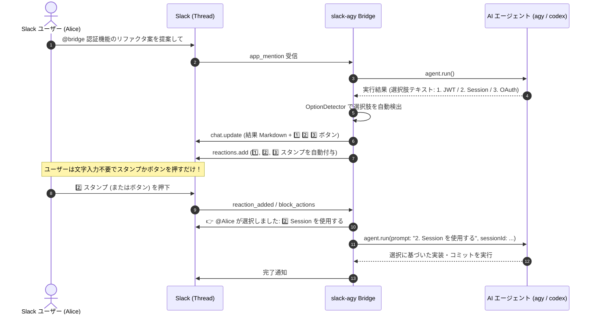

# 機能要件・Slack仕様 (Functional Specification)

## 1. ユーザー認証・OS ユーザー連動仕様

### 1.1 ユーザーマッピング (Slack User ⇄ Linux OS User)
- 各 Slack ユーザー（Slack User ID）は、設定ファイルにより Linux 上の OS ユーザーアカウント（例: `alice`, `bob`, `oharato`）と 1:1 で紐付けられます。
- Slack からの要求を受信した際、Bridge は発信者の Slack ID を検証し、対応する OS ユーザーの権限で `agy`、`gh`、`git` プロセスを起動します。
- スレッド開始時、実行ユーザー情報が Slack に明示されます：
  ```text
  👤 実行ユーザー: @Alice (OS User: `alice`)
  📂 作業ワークツリー: `/var/workspace/shared/worktrees/wt_thread_123`
  🌿 ブランチ: `feat/alice-fix-auth`
  ```

---

## 2. Git Worktree & リポジトリ連携機能

### 2.1 Git Worktree 運用の概要
複数の開発者が同一リポジトリに対して同時に指示を出してもファイル競合（コンフリクト）が発生しないよう、スレッドごとに **Git Worktree** を自動作成します。

```text
共有リポジトリ (Base Repo): /var/workspace/shared/repos/web-app.git
   ├── Worktree 1 (Alice のスレッド): /var/workspace/shared/worktrees/wt_alice_123 (ブランチ: feat/login-ui)
   └── Worktree 2 (Bob のスレッド):   /var/workspace/shared/worktrees/wt_bob_456   (ブランチ: fix/api-timeout)
```

- 各 Worktree は独立したワーキングディレクトリであるため、`agy` が `pnpm install`, `pnpm test`, ファイル編集等を同時に実行しても完全に隔離されます。
- `git commit` や `git push`, `gh pr create` は各 OS ユーザーの SSH 鍵および GitHub トークンを用いて実行されます。

### 2.2 リポジトリ未指定時の自由相談・一般調査モード
特定のリポジトリを指定せずに `@agy <質問>` や DM で呼び出した場合、エラーで拒否せず**自由相談・調査モード**として実行します：
- **作業ディレクトリ (CWD)**: 実行ユーザーのホームディレクトリ（`/home/<osUser>`）
- **動作仕様**:
  - Web 検索、一般的なコード相談、サーバー内のファイル調査、技術比較などを即座に実行可能。
  - セッション中に後から `!repo <リポジトリ名>` や `repo:<リポジトリ名>` を入力することで、いつでも該当リポジトリの Git Worktree を作成し、リポジトリ作業モードへシームレスに切り替えることができます。

---

## 3. コマンドインターフェース

Slack メッセージのプレフィックス（`!` または `@bridge <cmd>` / `@agy <cmd>`）により、エージェントやリポジトリ、Worktree、セッションを操作できます。

| コマンド | 引数 | 説明 |
| :--- | :--- | :--- |
| **`!help`** | なし | 利用可能なコマンド一覧とスタンプ承認の使い方ガイドを表示します。 |
| **`!agent`** | `<agy \| codex>` | スレッドの実行 AI エージェント（Antigravity `agy` または OpenAI Codex `codex`）を切り替えます。異なるエージェントへの切り替え時は対話履歴が自動リセットされます。 |
| **`!repo`** | `<repo_name \| git_url>` | スレッドの作業対象リポジトリを指定。共有ディレクトリに存在しない場合は自動で `git clone`（または `gh repo clone`）し、スレッド専用の Worktree を作成します。 |
| **`!pr`** | `[title]` | 現在のブランチをリモートに push し、ユーザーの `gh` 認証情報で Pull Request を作成します。 |
| **`!clean` / `!done`** | なし | タスク完了時に現在の Worktree を削除 (`git worktree remove`) してディスク容量を解放します。 |
| **`!status` / `!info`** | なし | 現在のスレッドに割り当てられた AI エージェント、OS ユーザー、Git Worktree パス、ブランチ、差分概要、セッション状態を表示します。 |
| **`!reset`** | なし | 現在のスレッドの対話履歴（セッションID）を破棄し、新しい対話コンテキストを開始します。 |
| **`!cancel`** | なし | 現在実行中のエージェントサブプロセスを緊急停止（SIGTERM/SIGKILL）します。 |

### 3.1 インラインオプション
自然言語プロンプト中に以下のタグを含めることで、1つのメッセージでエージェントやリポジトリを指定して実行できます：
- **`agent:<agy|codex>`**: 実行エージェントを指定（例: `@bridge agent:codex この型エラーを直して`）
- **`repo:<リポジトリ名>`**: 作業リポジトリを指定（例: `@bridge repo:backend-service agent:agy リファクタリングして`）


---

## 4. Slack UI / UX 設計

### 4.1 進捗表示（Progress Card & デバウンス更新）
AGY の高速なストリーミング出力を 800ms〜1秒間隔でバッファリング更新し、Slack API のレート制限（429 Too Many Requests）を回避しながらリアルタイムに進捗を表示します。

```text
━━━━━━━━━━━━━━━━━━━━━━━━━━━━━━━━━━━━
⚙️ AGY 実行中... (OS User: alice | 経過時間: 18秒)
━━━━━━━━━━━━━━━━━━━━━━━━━━━━━━━━━━━━
🌿 Branch: feat/alice-fix-auth
📂 CWD: /var/workspace/shared/worktrees/wt_thread_123

▶ 思考中 (Reasoning...)
✔ ツール実行完了: grep_search (Pattern: "handleAuth")
⚙ ツール実行中: run_command (pnpm test)
━━━━━━━━━━━━━━━━━━━━━━━━━━━━━━━━━━━━
```

### 4.2 完了表示
```text
認証APIの型エラーを修正し、テストが全件パスすることを確認しました。
変更内容をコミット（`9a3f12c`）しました。

【主な変更点】
- `src/auth/jwt.ts`: null チェックを追加
- `src/types/auth.d.ts`: Payload 型の定義を修正

────────────────────────────────────
👤 実行者: alice | ⏱️ 14.2s | 🪙 22,410 | 🆔 f0f0c605...
💡 `!pr [タイトル]` で GitHub に Pull Request を作成できます。
```

### 4.3 長文メッセージ・Git 差分のファイル自動フォールバック (4,000文字対策)
AGY の出力コードや `git diff`、ログ情報が Slack メッセージの上限（4,000文字）を超える場合、メッセージ本文での切り捨てを防止するため、自動的に **Slack スニペットファイル (`files.uploadV2`)** としてスレッドにアップロードします。

```text
📄 【詳細差分・実行ログ】 (文字数制限超過のためファイル添付)
ファイル名: `diff_output.patch` (34.2 KB)
スレッドにアップロードしました。
```

---

## 5. インタラクティブ承認・選択肢スタンプ & ボタン連携機能 (Interactive Reaction & Button Approvals)

AI エージェント（Antigravity `agy` または OpenAI Codex `codex`）がユーザーに対して実行許可（コマンド実行・デプロイ承認など）や方針選択（`ask_question` ツール呼び出し、または回答テキスト内での選択肢提示）を提示した際、Bridge はスレッド内に確認メッセージを投稿し、**選択肢となるスタンプ（絵文字リアクション）を自動付与**し、さらに **Slack Block Kit のボタンコンポーネント** も同時に配置します。

ユーザーは**スタンプまたはボタンをクリックするだけ**で、文字入力なしで即座に次のターンが自律実行されます。



### 5.1 選択肢の自動検出 (`OptionDetector`) と対応パターン
AI エージェントの回答に含まれる以下の選択肢フォーマットを自動認識し、対応する絵文字リアクションとボタンを生成します：

1. **番号付きリスト**:
   - `1. xxx` / `2. yyy` / `3. zzz`
   - `1) xxx` / `2) yyy` / `3) zzz`
   - `[1] xxx` / `[2] yyy` / `[3] zzz`
   - `1️⃣ xxx` / `2️⃣ yyy` / `3️⃣ zzz`
2. **アルファベット付きリスト**:
   - `A. xxx` / `B. yyy` / `C. zzz`
   - `A) xxx` / `B) yyy` / `C) zzz`
   - `[A] xxx` / `[B] xxx` / `[C] xxx`
3. **承認・確認形式 (Yes/No)**:
   - `- ✅ 変更をコミットしてPRを作成する`
   - `- ❌ 変更を取り消して中断する`
   - 「よろしいですか？」「続行しますか？」などの文脈

### 5.2 実行許可・確認要求 (Yes/No Approval)
危険度の高い操作や外部連携（PR作成・デプロイ・破壊的変更など）の実行前に、ユーザーへ承認を要求します。

```text
⚠️ 【確認・許可要求】 @Alice
本番デプロイコマンド `pnpm run deploy` を実行しますか？

👇 下のスタンプまたはボタンを押して回答してください：
  • ✅ (:white_check_mark:) : 許可して続行
  • ❌ (:x:) : 拒否して中止
```

- **Bot による自動スタンプ付与**: メッセージ投稿直後に Bot が `:white_check_mark:` (✅) と `:x:` (❌) を自動リアクション。
- **ユーザー操作と状態更新**:
  - **✅ 押下**: `✅ 【許可済み】 @Alice が実行を許可しました。処理を続行します...` にメッセージを更新し、エージェントへ承認信号を送信。
  - **❌ 押下**: `❌ 【拒否・中止】 @Alice が実行を拒否しました。この操作はスキップされました。` に更新し、エージェントに拒否信号を送信。

### 5.3 複数選択式の質問応答 (`ask_question` / 完了時選択肢提示)
エージェントから実装方針や選択肢の確認を求められた場合、番号スタンプおよびボタンによる選択を提供します。

```text
❓ 【質問・方針確認】 @Alice
認証トークンの保存先をどちらにしますか？

  1️⃣ : JWT (HttpOnly Cookie)
  2️⃣ : OAuth2 Bearer Token
  3️⃣ : Session Store (Redis)

👇 該当する番号のスタンプまたはボタンを押して回答してください。
```

- **Bot による自動スタンプ付与**: 選択肢の数に応じて `1️⃣` (`:one:`), `2️⃣` (`:two:`), `3️⃣` (`:three:`)... を自動付与。
- **ユーザー選択時**:
  - スレッドに「👉 <@Alice> が選択しました： **2️⃣ OAuth2 Bearer Token**」と投稿し、選択された選択肢を次の入力プロンプトとしてエージェントが自動継続実行。

### 5.4 セキュリティ & 誤操作防止仕様
1. **実行権限者の厳格な検証**:
   - スレッドを担当する Slack ユーザー本人（上記例では `@Alice`）以外のスタンプ/ボタン押下は無視されます。
2. **二重実行防止 (Idempotency)**:
   - 最初の有効なスタンプ/ボタン押下時点で登録が消費されるため、連打や複数人による競合が防止されます。
3. **タイムアウト処理 (デフォルト5分)**:
   - 同期待機中の質問・承認要求に対して5分以内にスタンプが押されない場合、安全のため自動的に「タイムアウト（拒否/スキップ）」として処理を中断し、Slack に通知します。


---

## 6. 複数人利用時のアクセス制御 & 分離ポリシー

1. **ユーザーマッピングの必須化**:
   - マッピング設定に存在しない Slack ユーザーからのメッセージは自動的に拒否。
2. **OS 権限の分離**:
   - Alice がトリガーしたタスクは OS ユーザー `alice` として実行されるため、Bob のプライベートファイル（`/home/bob/` 直下等）への不正アクセスは Linux のファイルパーミッションによってブロックされます。
3. **共有ディレクトリのグループ権限**:
   - `/var/workspace/shared` 以下の共有リポジトリおよび Worktree は、共通の `developers` グループ（`setgid` + `umask 002` または POSIX ACL）により、全開発者 OS ユーザーが相互に読み書き可能。
4. **危険コマンドのガードレール & 確認強制**:
   - システム破壊系コマンド（`rm -rf /` 等）や管理者領域への不正操作は Bridge 側で事前にブロック。また、`git push --force` やデプロイコマンド等の重大操作はスタンプ承認（Section 5）を強制。
5. **Worktree 内シークレット保護**:
   - 共有 Worktree 内に生成される `.env.local` や個人用認証情報は `.gitignore` で確実に除外し、リポジトリにコミットされないようガード。

---

## 7. Slack Block Kit Markdown ブロックによるテーブル表示 & リッチフォーマット

AGY（Google Antigravity CLI）が生成する標準 Markdown / GFM 形式の出力を、Slack 公式の **Block Kit Markdown ブロック (`type: "markdown"`)** を用いて投稿します。
従来の Slack 独自記法（`mrkdwn`）では実現できなかった **表（テーブル）の美しい罫線レンダリング** や言語別シンタックスハイライト、タスクリスト（チェックボックス）が Slack チャット上にネイティブ表示されます。

### 7.1 Markdown レンダリング対応要素一覧
| Markdown 要素 | 記法例 | Slack 表示動作 |
|---|---|---|
| **テーブル (表)** | `\| ユーザー \| 状態 \|\n\|---|---|\n\| Alice \| Active \|` | **Slack ネイティブ表コンポーネント** としてグリッド描画 |
| **シンタックスハイライト** | ````python\ndef foo(): pass\n```` | プログラミング言語ごとのカラーハイライト表示 |
| **タスクリスト** | `- [x] 完了\n- [ ] 未完了` | チェックボックス付きリストとして表示 |
| **見出し** | `# H1` / `## H2` / `### H3` | 大小見出しフォントとして美しくレンダリング |
| **太字・斜体・取消線** | `**太字**` / `*斜体*` / `~~取消線~~` | 各種インライン装飾をネイティブ解釈 |
| **Web リンク** | `[ドキュメント](https://...)` | 標準の Markdown リンク記法のままクリック可能リンク化 |
| **ローカルファイルリンク** | `[docs.md](file:///path/to/docs.md)` | `docs.md` / `docs.md:L10-L20` などの見やすいインラインコード表記に自動最適化 |
| **GitHub Alerts** | `> [!NOTE] 内容` / `> [!WARNING] 注意` | `> 💡 **[NOTE]** 内容` / `> ⚠️ **[WARNING]** 注意` 等の絵文字付き引用に変換 |

### 7.2 長文メッセージの安全分割 & プレビュー付きファイル添付
Slack Block Kit の Markdown ブロック上限（1メッセージあたり累計 12,000 文字）に基づき、快適に閲覧できるように自動判定を行います：

- **10,000 文字以下**:
  - `MessageChunker.splitIntoMarkdownChunks` により、テーブルやコードブロックを途中で破壊しないようブロック単位（約3,000文字単位）で安全に分割し、`type: "markdown"` ブロックとしてスレッド内に直接リッチ描画。
- **10,000 文字超（巨大ログ・大規模差分）**:
  1. スレッド上の進捗メッセージを **先頭 1,500 文字の要約プレビュー** で更新。
  2. Slack の `files.uploadV2` API を用いて、完全な実行結果テキスト（`.txt` / `.patch`）をスレッドに自動ファイル添付。


