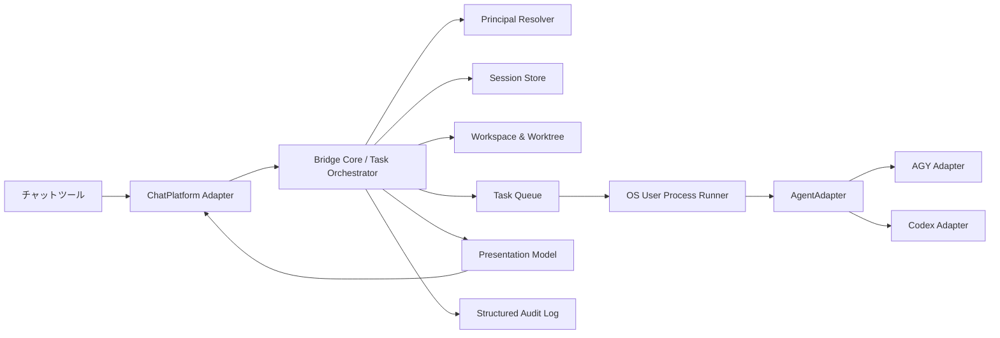
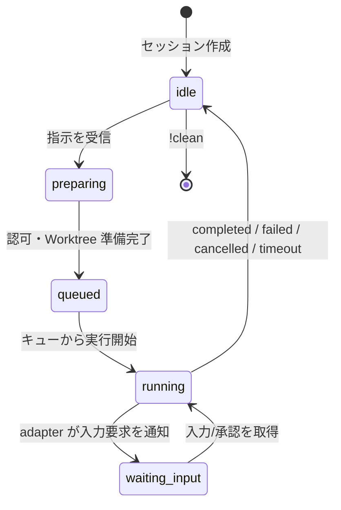

# チャットプラットフォーム・AIエージェント抽象化設計

## 1. 目的

現行の Slack-AGY Bridge を、任意のチャットツールと任意のローカル AI エージェント CLI を組み合わせられる **Agent Bridge** にリファクタリングする。

初回の提供範囲は以下とする。

| 種別 | 初期実装 | 備考 |
| --- | --- | --- |
| チャットプラットフォーム | Slack | 既存 Socket Mode の利用を維持 |
| AI エージェント | Antigravity (`agy`), Codex CLI (`codex`) | スレッド開始時に選択。未指定時は既定値 |
| 実行環境 | Linux の OS ユーザー切替 + Git Worktree | 既存の分離・監査モデルを維持 |

当面のチャットプラットフォーム実装は Slack のみとする。Discord、Microsoft Teams 等の追加は、将来コアを変更せず `ChatPlatform` アダプタを追加して対応する。エージェント追加も同様に `AgentAdapter` の追加だけで行う。

### 非目標

- 複数チャットプラットフォームを一つの会話・セッションとして相互同期すること
- 同一スレッドで実行中にエージェントを切り替えること
- 各 CLI の権限確認プロトコルを無理に共通の対話プロトコルへ変換すること
- 初回リファクタリングで既存の Slack UX、Worktree、PR 操作を変更すること

## 2. 現状と課題

現状は `src/handlers/` が Slack Bolt のイベント、Slack Client、Slack の ID 形式、Slack 用フォーマッタ、および `PrivilegeRunner.runAgy` に直接依存している。`PrivilegeRunner` も AGY の CLI 引数と NDJSON スキーマを内包している。そのため、チャットツールまたはエージェントを一つ追加するたびに、ハンドラ・セッション・表示・実行機構を横断して改修する必要がある。

一方、ユーザーからの指示を OS ユーザーとして実行し、スレッドごとに Worktree と実行キューを割り当てる部分は製品共通の価値であり、プラットフォームやエージェントから独立できる。

## 3. 設計方針

1. **Ports and Adapters**: コアはチャット SDK とエージェント CLI を import しない。外部サービスはアダプタに閉じ込める。
2. **正規化イベント**: 各 CLI の出力を共通 `AgentEvent` に変換する。UI はエージェント固有イベントを直接解釈しない。
3. **不透明な継続ID**: `conversation_id` を `agentSessionId` に改名し、値の形式・作り方はアダプタに委譲する。
4. **スレッドごとの固定選択**: スレッド開始時に `!agent <id>` またはメンションのオプションで選択した `agentId` を保存する。未選択時は `defaultAgent` を使い、設定変更後も既存スレッドは元のエージェントで継続できる。
5. **安全なデフォルト**: 実行エージェント、許可する OS ユーザー、チャット空間を allowlist で制限する。通常の開発操作は自動承認し、危険操作はブリッジのポリシーで検知してチャット上の明示承認を求める。
6. **能力ベースの UX**: リアクション承認・ストリーミング・会話再開を必須機能と見なさない。非対応の機能は共通コアが安全に縮退する。

## 4. 目標アーキテクチャ



### レイヤーの責務

| レイヤー | 責務 | 依存してよいもの |
| --- | --- | --- |
| Bridge Core | 認可、コマンド、セッション、Worktree、キュー、タスクの状態遷移 | 定義したポートのみ |
| Chat Platform Adapter | 受信イベントの正規化、投稿・更新・添付・リアクション | 各チャット SDK |
| Agent Adapter | CLI 起動定義、出力パース、継続、取消、能力宣言 | 当該 CLI の仕様 |
| Process Runner | `sudo -u`、環境変数、子プロセス、タイムアウト、シグナル | Node.js プロセス API |
| Presentation | 共通 Markdown と進捗状態からチャット固有の表示を生成 | `ChatCapabilities` |

## 5. コアのポート定義

型名は実装時のたたき台であり、SDK の型を公開インターフェースに漏らさない。

```ts
// src/core/chat/types.ts
export interface ChatInboundMessage {
  platform: string;
  messageId: string;
  conversationId: string;       // channel / room / DM の不透明ID
  threadId: string;             // 未対応のツールでは conversationId と同値
  sender: { id: string; displayName?: string };
  text: string;
  isDirectMessage: boolean;
  mentionsBot: boolean;
}

export interface ChatMessageRef {
  conversationId: string;
  threadId: string;
  messageId: string;
}

export interface ChatCapabilities {
  threads: boolean;
  messageUpdate: boolean;
  attachments: boolean;
  reactions: boolean;
}

export interface ChatPlatform {
  readonly id: string;
  readonly capabilities: ChatCapabilities;
  start(onMessage: (message: ChatInboundMessage) => Promise<void>): Promise<void>;
  stop(): Promise<void>;
  postMessage(target: Omit<ChatMessageRef, "messageId">, body: ChatMessage): Promise<ChatMessageRef>;
  updateMessage(ref: ChatMessageRef, body: ChatMessage): Promise<void>;
  uploadText?(target: Omit<ChatMessageRef, "messageId">, file: TextAttachment): Promise<void>;
  addChoice?(ref: ChatMessageRef, choices: ChatChoice[]): Promise<void>;
}
```

```ts
// src/core/agent/types.ts
export type AgentEvent =
  | { type: "started"; agentSessionId?: string }
  | { type: "progress"; text: string }
  | { type: "tool_call"; name: string; arguments?: Record<string, unknown> }
  | { type: "notice"; text: string }
  | { type: "completed"; response: string; agentSessionId?: string }
  | { type: "failed"; message: string; retryable: boolean };

export interface AgentCapabilities {
  resumable: boolean;
  streamsProgress: boolean;
  interactiveInput: boolean;
}

export interface AgentRunRequest {
  taskId: string;
  prompt: string;
  cwd: string;
  osUser: string;
  agentSessionId?: string;
  timeoutMs: number;
  onEvent(event: AgentEvent): void;
}

export interface AgentAdapter {
  readonly id: string;
  readonly capabilities: AgentCapabilities;
  run(request: AgentRunRequest): Promise<AgentRunResult>;
  cancel(taskId: string): boolean;
}
```

`ProcessRunner` は `AgentAdapter` の内部実装から利用し、アダプタが argv・stdin・stdout パーサーを組み立てる。これにより `sudo` 実行の安全性を共有しつつ、`agy` と `codex` の出力仕様を分離できる。

## 6. セッションと認可モデル

既存の `channelId:threadTs` は Slack 固有であるため、次の形に置換する。

```ts
interface SessionInfo {
  key: string;                  // `${platform}:${conversationId}:${threadId}`
  platform: string;
  conversationId: string;
  threadId: string;
  principalId: string;          // チャットツール内の発信者ID
  osUser: string;
  agentId: string;
  agentSessionId?: string;      // AGY/Codex 等の継続ID。不透明値
  repoName?: string;
  branchName?: string;
  worktreePath: string;
  status: "idle" | "running" | "waiting_input";
}
```

`UserMapper` は `PrincipalResolver` に改名し、`{ platform, principalId } -> osUser` を解決する。設定はプラットフォームごとに独立させる。これにより Slack と Discord で同じ表示名・ID が偶然重なる問題を避ける。Codex の認証はサービスアカウントで共有せず、解決された各 OS ユーザーが自身の Codex にログインした状態で利用する。

認可は次の順番で必ず実行する。

1. プラットフォームアダプタが署名・トークンを検証する。
2. コアが `platform + conversationId` の allowlist を確認する。
3. `PrincipalResolver` が発信者と OS ユーザーの対応を解決する。
4. 選択された `agentId` が allowlist と設定済みアダプタに含まれることを確認する。
5. Worktree を作成し、指定 OS ユーザーとしてエージェントを起動する。

## 7. Codex CLI アダプタ

Codex はローカル CLI をプロセスとして実行する `CodexCliAdapter` で対応する。現行環境の Codex CLI では、非対話実行に `codex exec`、JSONL 出力に `--json`、会話再開に `codex exec resume <session-id>` が利用できる。アダプタは CLI の生イベントをアプリ全体に公開せず、上記 `AgentEvent` に変換する。

### 起動規約

新規実行の概念的な argv:

```text
codex exec --json --cd <worktree> --sandbox workspace-write --approve-for-me <prompt>
```

継続実行の概念的な argv:

```text
codex exec resume <agentSessionId> --json --cd <worktree> <prompt>
```

実装ではユーザーの入力・パス・ID をシェル文字列に連結しない。常に `spawn(command, args)` で引数配列を渡す。`agentSessionId` は Codex の JSONL イベントから取得できた場合のみ保存し、取得不能・resume 失敗時は新規セッションとして安全に再試行する（ユーザーへ履歴が継続されない旨を通知）。

### Codex の安全設定

- 初期値は `sandbox = "workspace-write"` と `approvalMode = "approve-for-me"` とする。Worktree 内のコード編集、テスト、Git 操作など通常の開発操作は自動承認する。
- `dangerously-bypass-approvals-and-sandbox` は本ブリッジの設定値として提供しない。
- Codex の認証情報・設定は `sudo -u <osUser> -H` で切り替えた各 OS ユーザーの Codex ホームを用いる。サービスアカウントの認証情報を開発者間で共有しない。
- CLI バージョン差分に備え、起動時ヘルスチェックで `codex exec --help` を実行して必要オプションを検証する。実行ごとのバージョンと選択したモデルは監査ログに残す。

### 危険操作の確認ポリシー

Codex CLI 自体は通常の操作を `--approve-for-me` で進める。ただし、Bridge がプロンプト・実行イベントを監視し、以下の操作を含む場合は実行前に Slack の担当者へ確認カードを投稿する。承認の受信後にのみ実行を継続し、拒否またはタイムアウト時は取消する。

| 区分 | 例 | 既定の扱い |
| --- | --- | --- |
| 破壊的なファイル操作 | `rm -rf`、Worktree 外への書込み、大量削除 | 要確認 |
| Git 履歴の破壊 | force push、`reset --hard`、共有ブランチへの直接 push | 要確認 |
| 外部への副作用 | デプロイ、リリース、課金を伴う API 呼出、Issue/PR の作成・更新 | 要確認 |
| 秘密情報・認証情報 | シークレットの表示・送信・更新、鍵ファイルへのアクセス | 要確認 |
| 権限・システム変更 | `sudo`、パッケージ導入、サービス再起動、ネットワーク設定 | 要確認 |
| 通常の開発操作 | Worktree 内の編集、テスト、lint、通常の Git add/commit | 自動承認 |

初期実装では、CLI イベントから確実に判定できるコマンドと Bridge 経由の副作用コマンドを対象にする。自由形式のシェルコマンドを完全に意味解析できないため、検知不能な危険操作まで安全にするものではない。OS 権限、Codex sandbox、対象ディレクトリの制限を防御の主軸とし、ポリシー検知は追加の防御層とする。

### エージェント別の差異

| 項目 | AGY | Codex CLI | コアでの扱い |
| --- | --- | --- | --- |
| セッション継続ID | `conversation_id` | Codex session/thread ID | `agentSessionId` |
| ストリーム | stream-json | `--json` JSONL | `AgentEvent` に正規化 |
| 承認質問 | 現行のリアクション連携を検討 | CLI の承認設定に委譲 | `interactiveInput` 能力で分岐 |
| 取消 | 子プロセスへシグナル | 子プロセスへシグナル | `AgentAdapter.cancel` |

Codex の JSONL イベント名・ペイロードは CLI バージョンで変わり得るため、実装時にバージョン固定のフィクスチャを収集し、`CodexStreamParser` の契約テストで守る。OpenAI の公式ドキュメント上、Codex はコーディングエージェントとして提供されており、API の利用形態とは分けて CLI アダプタとして扱う。 [OpenAI Developers](https://developers.openai.com/)

## 8. Slack アダプタへの置換

`SlackPlatform` が `@slack/bolt` の唯一の依存箇所となる。次をここへ移動する。

- `app_mention`、DM、スレッド返信、`reaction_added` の受信
- Slack の `<@...>` メンション除去、Slack link 記法の正規化
- `chat.postMessage`、`chat.update`、`files.uploadV2`、`reactions.add`
- Block Kit への変換と Slack の文字数・レート制限

`ProgressThrottler` は Slack Client 型への依存を除き、`ChatPlatform.updateMessage` を受け取る `ProgressReporter` に置換する。メッセージ更新に未対応のツールでは「一定間隔で新規投稿」または「開始・終了のみ投稿」という実装を選べる。

コマンドは `CommandRouter` をコアへ移し、チャット由来の名称を除く。`!repo`、`!pr`、`!status`、`!clean`、`!reset`、`!cancel` の意味は維持する。`!agent <id>` は **新規セッションの開始前のみ**選択を許可する。既存セッションでは `!reset` 後に切替を案内する。

スレッド開始の例:

```text
@bridge !agent codex
@bridge repo:org/repo この型エラーを修正して
```

または 1 メッセージにまとめて指定する。

```text
@bridge agent:codex repo:org/repo この型エラーを修正して
```

エージェント指定がない場合は `bridge.defaultAgent` を使用する。

## 9. 設定案

既存環境変数を一度に削除せず、新しい構造化設定（YAML または JSON）を導入する。秘密情報は環境変数またはシークレットストア参照に限定する。

```yaml
bridge:
  defaultAgent: codex
  allowedConversations:
    slack: ["C012345"]
  principals:
    slack:
      U012345: alice

platforms:
  slack:
    type: slack-socket-mode
    botTokenEnv: SLACK_BOT_TOKEN
    appTokenEnv: SLACK_APP_TOKEN

agents:
  codex:
    type: codex-cli
    command: codex
    model: null                 # null = OS ユーザーの Codex 設定に従う
    sandbox: workspace-write
    approvalMode: approve-for-me
    dangerousOperationPolicy: require-chat-approval
    timeoutMs: 600000
  agy:
    type: agy-cli
    command: agy
    permissionMode: dangerously-skip-permissions
    timeoutMs: 600000
```

環境変数は `BRIDGE_CONFIG_PATH`、Slack トークン、必要に応じた CLI パスだけに寄せる。移行期間は既存の `SLACK_*` と `AGY_*` 相当の設定を旧形式として読み、警告ログを出して新形式へ変換する。

## 10. ディレクトリ構成案

```text
src/
  core/
    bridgeService.ts
    commandRouter.ts
    chat/types.ts
    agent/types.ts
    presentation/
  platforms/
    slack/slackPlatform.ts
    slack/slackRenderer.ts
  agents/
    processRunner.ts
    agy/agyAdapter.ts
    agy/agyStreamParser.ts
    codex/codexCliAdapter.ts
    codex/codexStreamParser.ts
  config/
    bridgeConfig.ts
    principalResolver.ts
  session/
  workspace/
  queue/
  logger/
```

既存の `workspace/`、`queue/`、`logger/` は極力そのまま移行する。既存 `handlers/` と `formatter/slackFormatter.ts` は Slack アダプタに吸収してから削除する。

## 11. 状態遷移



実行開始時に `agentId` を読み、終了時に返された `agentSessionId` を同じセッションへ保存する。`!reset` はこの値のみを消去するため、Worktree とブランチは維持される。

## 12. 段階的な移行計画

1. **SQLite 永続化基盤**: Node 24 の `node:sqlite` を使い、JSON セッションストアを SQLite に移行する。永続ジョブはスレッド内順序・全体並行数を保持して予約する。再起動時に `running` / `waiting_approval` のジョブは自動再実行せず `interrupted` にする。
2. **契約の導入**: `ChatPlatform`、`AgentAdapter`、共通セッションIDを追加し、既存の振る舞いを変えない。
3. **AGY の移植**: `PrivilegeRunner.runAgy` と `StreamParser` を `AgyAdapter` へ移す。既存テストをアダプタ契約テストへ移す。
4. **Slack の移植**: Bolt ハンドラと Slack Formatter を `SlackPlatform` へ閉じ込め、`BridgeService` に一本化する。メンション、DM、スレッド、ファイル添付、リアクションの回帰テストを行う。
5. **Codex を追加**: `CodexCliAdapter`、JSONL フィクスチャ、resume/キャンセル/タイムアウト/危険操作の承認テストを追加する。各 OS ユーザーの Codex ログインと `defaultAgent: codex` を設定したステージング環境で検証する。
6. **設定移行**: 新設定を既定にし、旧 Slack/AGY 変数の非推奨警告を一リリース維持する。
7. **次のプラットフォーム**: Discord 等を一つ追加し、コアにプラットフォーム固有 import が残っていないことを確認する。

## 13. 受け入れ基準

- `defaultAgent=agy` で既存の Slack フロー（メンション、DM、継続、キャンセル、Worktree、PR）が回帰しない。
- `defaultAgent=codex` で Slack スレッドから Codex が対象 Worktree で実行され、進捗・完了・エラー・取消が表示される。
- 同一 Slack スレッドの 2 回目の Codex 指示で、保存済み `agentSessionId` を使った resume が試行される。
- スレッド開始時の `!agent codex` と `agent:codex` が選択を保存し、未指定時は `defaultAgent` が保存される。
- 通常の Worktree 内の編集・テストは確認なしで実行され、危険操作は担当 Slack ユーザーの明示承認なしに実行されない。
- Slack SDK 型、Slack ID、AGY/Codex の生イベント型が `src/core/` に存在しない。
- 未マッピングユーザー、未許可会話、未設定エージェントは CLI を起動せず拒否される。
- 監査ログに `platform`、`principalId`、`osUser`、`agentId`、`agentSessionId`（マスク可）、Worktree、実行結果が記録される。

## 14. 主なリスクと対応

| リスク | 対応 |
| --- | --- |
| Codex CLI の JSONL 仕様・resume ID が更新される | CLI バージョン固定、起動時検証、実出力フィクスチャの契約テスト、パーサーをアダプタ内に隔離 |
| CLI の承認・サンドボックス設定がエージェントごとに異なる | 共通化せずアダプタ設定と能力宣言で表現。危険な無制限モードを既定にしない |
| チャットツールにスレッドや更新 API がない | `ChatCapabilities` を見て会話ID同一視・新規投稿への縮退を行う |
| 既存セッションと新しいID形式の互換性 | 読み込み時に Slack 旧キーを変換し、移行期間中は旧 `conversationId` を `agentSessionId` として読む |
| コード重複が移行途中で増える | AGY → Slack → Codex の順で縦に切り替え、各段階で古い経路を削除する |
