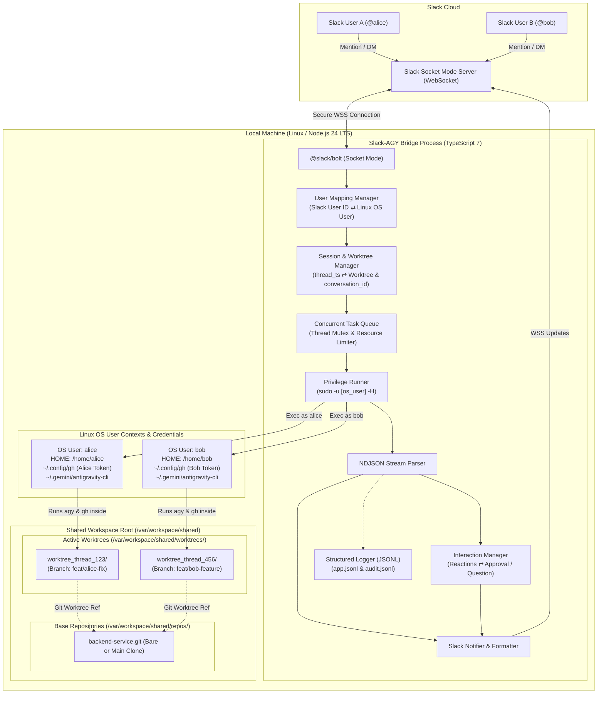
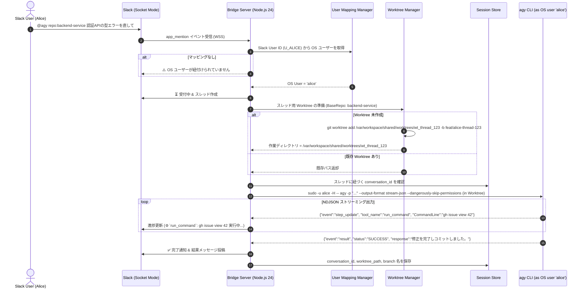

# システム全体構成 (System Architecture)

## 1. 概要

Slack-AGY Bridge は、Slack 上の複数ユーザーからの指示をトリガーとして、ローカルマシン上の Google Antigravity CLI (`agy`) や GitHub CLI (`gh`) を実行するマルチユーザー対応ブリッジシステムです。

本システムは以下の要件を満たすよう設計されています：
- **Node.js 24 LTS & TypeScript 7** による堅牢な基盤
- **Slack ユーザー ⇄ Linux OS ユーザーの紐付け**: 各ユーザーの認証情報（AGY 設定、GitHub Token、SSH 鍵）でプロセスを実行
- **Git Worktree の活用**: 共有リポジトリからスレッドごとに独立した作業ツリーを動的に作成し、複数人の並行作業でも競合しない開発環境を提供
- **全ユーザー共有ワークスペース**: 適切なグループ権限・ACL 設計により、共通のベースリポジトリと作業ディレクトリを運用
- **Socket Mode (WebSocket)**: ポート開放不要で安全に稼働

---

## 2. システム構成図

---

## 3. シーケンス図 (マルチユーザー & Git Worktree 連携フロー)

---

## 4. 主要コンポーネントの責務

### 4.1 User Mapping Manager (`src/handlers/userMapper.ts`)
- Slack のユーザー ID (`Uxxxxxxxxxx`) と Linux 上のローカルユーザー名（例: `alice`, `bob`, `oharato`）の対応関係を管理。
- 未登録ユーザーからの呼び出しを拒否するセキュリティゲートウェイとして機能。

### 4.2 Worktree & Workspace Manager (`src/workspace/worktreeManager.ts`)
- 共有ワークスペース（`/var/workspace/shared` 等）内のベースリポジトリを管理。
- Slack スレッド開始時に `git worktree add` を実行し、スレッド専用のブランチと独立作業ディレクトリを作成。
- スレッド終了時（`!reset` や `!done`）に `git worktree remove` によるクリーンアップを実施。
- リポジトリの新規 clone（`git clone` / `gh repo clone`）を OS ユーザー権限で代行。

### 4.3 Privilege Runner (`src/runner/privilegeRunner.ts`)
- `sudo -u <os_user> -H -- ...` を利用して、指定した OS ユーザーとして `agy` や `gh`、`git` プロセスを起動。
- 対象ユーザーの `$HOME`、`PATH`、`USER`、`XDG_CONFIG_HOME` などの環境変数を安全にロード。
- `~/.config/gh/`（GitHub CLI 認証トークン）や `~/.gemini/antigravity-cli/`（AGY 設定・認証）がそのまま適用される。

### 4.4 Session Manager (`src/session/sessionStore.ts`)
- Slack スレッド ID (`channel_id:thread_ts`) に対し、以下の情報を一元管理・永続化：
  - OS ユーザー名
  - AGY `conversation_id`
  - 対象リポジトリ & ブランチ名
  - 作成された Git Worktree パス
  - 最終アクティブ日時

### 4.5 Structured Logger (`src/logger/logger.ts` & `src/logger/auditLogger.ts`)
- **JSONL (NDJSON) 形式による構造化ログ**: 全アプリケーションログ (`logs/app.jsonl`) およびセキュリティ監査ログ (`logs/audit.jsonl`) を 1 行 1 JSON 形式でストリーム追記。
- **リクエストトレーサビリティ**: `traceId` や Slack コンテキスト（`userId`, `channelId`, `threadTs`）、OS ユーザー名を各ログエントリに自動バインド。
- **AGY NDJSON 出力との統一**: AGY の実行イベントと Bridge のライフサイクルイベントを一貫したフォーマットで蓄積し、DuckDB や `jq` での高速クエリ・監視を実現。

### 4.6 Interaction Manager (`src/interaction/interactionManager.ts`)
- **スタンプ（絵文字リアクション）連携**: AGY がユーザーに実行確認や質問（`ask_question`）を求めた際、スレッドに確認メッセージを投稿して選択肢スタンプ（✅/❌ や 1️⃣/2️⃣/3️⃣）を自動付与。
- **権限者検証 & Promise 待機制御**: 該当スレッドの担当 Slack ユーザー本人がスタンプを押すまで非同期に待機し、押下されたスタンプに応じて AGY サブプロセスに入力を渡して自動再開。
- **5分タイムアウト保護**: 応答がない場合の自動キャンセル処理および二重実行防止。

### 4.7 Progress Throttler & Message Chunker (`src/formatter/`)
- **ProgressThrottler**: 高頻度な AGY ストリーミング出力を 800ms〜1秒間隔でバッファリング更新し、Slack API の Rate Limit（429 Too Many Requests）を回避。
- **MessageChunker**: 4,000 文字制限を超える長文レスポンスや diff を自動検知し、`files.uploadV2` を介してスニペットファイルとして添付。

### 4.8 Repo Mutex & Worktree Cleaner (`src/workspace/`)
- **RepoMutex**: 同一 BaseRepo に対する並行 `git worktree add` / `git fetch` 実行時の `.git/index.lock` 競合を防止するインメモリ排他ロック。
- **WorktreeCleaner**: 放置された Worktree（TTL: 7日間）を自動検出・削除し、共有ディスクの枯渇を防止するガベージコレクション。

