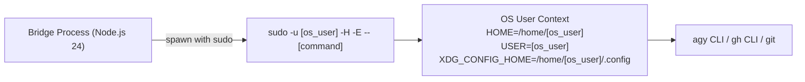
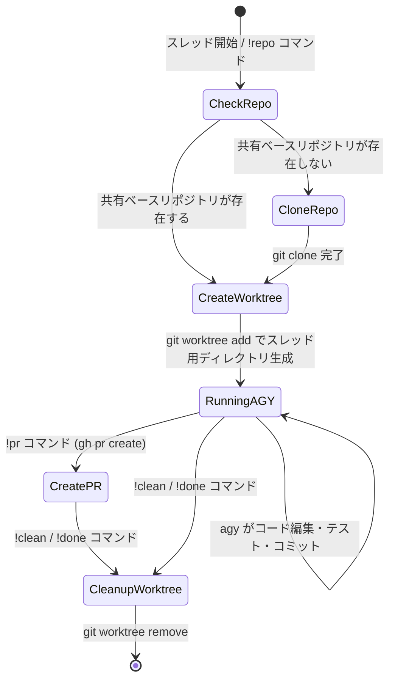
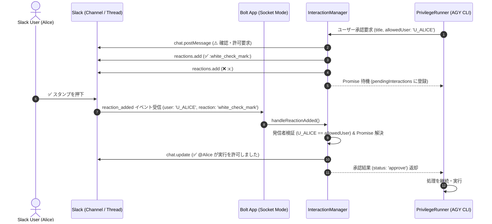

# 技術設計・実装詳細 (Technical Design)

## 1. 開発環境・技術スタック方針

- **ランタイム**: Node.js 24 LTS (v24.x)
- **言語 & コンパイラ**: TypeScript 7.x (`typescript@7.0.2`, `strict: true`)
- **テストフレームワーク**: Vitest (`vitest@4.1.11`)
- **Linter & Formatter**: Oxlint (`oxlint@1.79.0`) & Oxfmt (`oxfmt@0.64.0`)
- **パッケージマネージャー**: `pnpm` (`https://npm.flatt.tech`)
- **サプライチェーン・セキュリティ**: リリース後 7 日以上経過した安定バージョンのみを固定指定

---

## 2. ディレクトリ構成

```text
slack-agy/
├── .env.example              # 環境変数テンプレート
├── .npmrc                    # registry=https://npm.flatt.tech
├── .oxlintignore             # Oxlint 除外設定
├── package.json              # 依存関係定義（バージョン完全固定）
├── pnpm-lock.yaml
├── tsconfig.json             # TypeScript 7 厳格設定
├── vitest.config.ts          # Vitest テスト設定
├── docs/                     # 設計仕様書一式
│   ├── README.md
│   ├── system_architecture.md
│   ├── functional_specification.md
│   ├── technical_design.md
│   ├── configuration_guide.md
│   └── slack_app_setup.md
├── src/
│   ├── index.ts              # アプリケーション起動エントリポイント
│   ├── config/               # 環境設定・Zodバリデーション・ユーザーマッピング
│   │   ├── env.ts
│   │   ├── userMap.ts
│   │   └── schema.ts
│   ├── logger/               # 構造化 JSONL ロガー & 監査ログ
│   │   ├── logger.ts
│   │   ├── auditLogger.ts
│   │   ├── types.ts
│   │   └── index.ts
│   ├── session/              # スレッド ⇄ Worktree & Conversation ID 管理
│   │   ├── sessionStore.ts
│   │   └── types.ts
│   ├── workspace/            # Git Worktree & 共有リポジトリ管理
│   │   ├── worktreeManager.ts
│   │   ├── worktreeCleaner.ts # 放置 Worktree の定期 GC (TTL)
│   │   ├── repoMutex.ts       # BaseRepo レベルの同時操作排他ロック
│   │   └── gitUtils.ts
│   ├── queue/                # 並行実行制限 & スレッド別 Mutex
│   │   └── taskQueue.ts
│   ├── runner/               # OSユーザー偽装 (sudo) & agy/gh 実行
│   │   ├── privilegeRunner.ts
│   │   ├── streamParser.ts
│   │   └── types.ts
│   ├── interaction/          # スタンプ連携・ユーザー承認・質問待機管理
│   │   ├── interactionManager.ts
│   │   ├── types.ts
│   │   └── index.ts
│   ├── handlers/             # Slack イベントハンドラ & コマンドルーティング
│   │   ├── mentionHandler.ts
│   │   ├── messageHandler.ts
│   │   ├── reactionHandler.ts
│   │   └── commandRouter.ts
│   └── formatter/            # Slack Block Kit / Markdown 変換 & Rate Limit 制御
│       ├── progressThrottler.ts # 800ms デバウンス進捗更新 (Rate Limit 対策)
│       ├── messageChunker.ts    # 4,000 文字制限フォールバック & ファイル化
│       ├── slackFormatter.ts
│       └── progressCard.ts
├── logs/                     # 構造化ログ出力ディレクトリ (git-ignored)
│   ├── app.jsonl             # アプリケーション・イベントログ
│   └── audit.jsonl           # セキュリティ・監査ログ
└── data/                     # セッション永続化データディレクトリ (git-ignored)
    └── sessions.json
```

---

## 3. OS ユーザー権限スイッチング (`PrivilegeRunner`)

### 3.1 実行メカニズム
Bridge プロセス（Node.js）は、Slack ユーザーに対応する Linux OS ユーザーのコンテキストでコマンドを実行するため、`sudo -u <os_user>` を用いてサブプロセスを生成します。



#### コマンド生成例
```typescript
import { spawn, ChildProcess } from 'node:child_process';

export interface RunOptions {
  osUser: string;
  cwd: string;
  command: string;
  args: string[];
}

export function spawnAsUser(options: RunOptions): ChildProcess {
  const { osUser, cwd, command, args } = options;

  // sudo -u <osUser> -H -- <command> <args...>
  const sudoArgs = ['-u', osUser, '-H', '--', command, ...args];

  return spawn('sudo', sudoArgs, {
    cwd,
    env: {
      ...process.env,
      HOME: `/home/${osUser}`,
      USER: osUser,
      LOGNAME: osUser,
      XDG_CONFIG_HOME: `/home/${osUser}/.config`,
    },
    stdio: ['pipe', 'pipe', 'pipe'],
  });
}
```

### 3.2 ユーザー別認証情報の適用
- **AGY**: `/home/<os_user>/.gemini/antigravity-cli/` 内のセッションログ・API認証・MCP設定を使用。
- **GitHub CLI (`gh`)**: `/home/<os_user>/.config/gh/hosts.yml` の OAuth トークンを使用（`gh pr create`, `gh issue view` 等がそのユーザーとして動作）。
- **Git**: `/home/<os_user>/.gitconfig` の `user.name`, `user.email`, SSH 鍵 (`~/.ssh/id_ed25519` 等) を使用。

---

## 4. 共有ワークスペース & Git Worktree 管理 (`WorktreeManager`)

### 4.1 共有ディレクトリと Linux 権限設計
複数の OS ユーザーが共有ワークスペース内でファイルを相互に読み書きできるよう、以下の Linux パーミッションモデルを採用します。

- **共通開発者グループ**: `developers` (全 OS ユーザーが所属)
- **共有ルートディレクトリ**: `/var/workspace/shared`
- **Setgid (SGID) の付与**:
  - `chmod 2775 /var/workspace/shared` により、配下に作成された新規ディレクトリ・ファイルが自動的に `developers` グループを継承。
- **POSIX ACL (Access Control Lists)**:
  - `setfacl -R -d -m g:developers:rwx /var/workspace/shared`
  - 新規作成されるファイル・ディレクトリにデフォルトでグループ `rwx` 権限を強制付与。

### 4.2 Git Worktree ライフサイクル管理



#### Worktree 管理のコード例
```typescript
import { execFile } from 'node:child_process';
import { promisify } from 'node:util';

const execFileAsync = promisify(execFile);

export class WorktreeManager {
  constructor(
    private readonly reposDir: string,     // /var/workspace/shared/repos
    private readonly worktreesDir: string // /var/workspace/shared/worktrees
  ) {}

  public async getOrCreateWorktree(
    repoName: string,
    threadKey: string,
    branchName: string,
    osUser: string
  ): Promise<string> {
    const safeKey = threadKey.replace(/[^a-zA-Z0-9_-]/g, '_');
    const worktreePath = `${this.worktreesDir}/${repoName}_${safeKey}`;
    const baseRepoPath = `${this.reposDir}/${repoName}`;

    // 既に Worktree が存在するか確認
    if (await this.exists(worktreePath)) {
      return worktreePath;
    }

    // Worktree を新規作成 (sudo -u <osUser> 経由で実行)
    await execFileAsync('sudo', [
      '-u', osUser, '-H', '--',
      'git', '-C', baseRepoPath,
      'worktree', 'add', '-b', branchName, worktreePath, 'HEAD'
    ]);

    return worktreePath;
  }

  public async removeWorktree(worktreePath: string, osUser: string): Promise<void> {
    await execFileAsync('sudo', [
      '-u', osUser, '-H', '--',
      'git', 'worktree', 'remove', '--force', worktreePath
    ]);
  }
}
```

### 4.3 BaseRepo 排他制御 (`RepoMutex`)
同一のベースリポジトリに対して複数のスレッドから同時に `git worktree add` や `git fetch` が行われた際、Git のリファレンスロック競合（`.git/index.lock`）が発生するのを防ぐため、インメモリの BaseRepo 排他ロック（Mutex）を適用します。

```typescript
export class RepoMutex {
  private activeLocks = new Set<string>();
  public async acquire(repoName: string): Promise<() => void>;
}
```

### 4.4 放置 Worktree の定期ガベージコレクション (`WorktreeCleaner`)
タスク完了後に `!clean` が実行されず放置された Worktree は、ディスク枯渇を防ぐため TTL（デフォルト: 7日間）に基づいて定期的に自動削除されます。

---

## 5. Slack API レート制限 & 4,000文字フォールバック設計

### 5.1 進捗更新のスロットリング / デバウンス (`ProgressThrottler`)
AGY の高速なストリーミングイベント（NDJSON）に対して毎回 `chat.update` を呼び出すと、Slack API の Rate Limit（Tier 3 / 1秒1回のスレッド更新制限）により HTTP 429 Too Many Requests が発生します。
これを防ぐため、**800ms〜1000ms 間隔で進捗バッファをフラッシュするスロットラー** を実装します。

```typescript
export class ProgressThrottler {
  // 800ms のデバウンスバッファリングにより、秒間数十回の AGY イベントを安全に Slack へ反映
  public update(text: string): void;
  public async flush(): Promise<void>;
  public cancel(): void;
}
```

### 5.2 4,000 文字制限対策 & ファイル自動フォールバック (`MessageChunker`)
Slack のメッセージ文字数制限（4,000文字）を超える長い AGY レスポンスや Git diff は、本文での切り捨てを防止し、自動的に `files.uploadV2` を用いてスニペットファイル（例: `diff.patch`, `output.txt`）としてスレッドにアップロードします。

---

## 6. 構造化ログ設計 (Structured JSONL Logging)

### 6.1 なぜ JSONL (JSON Lines / NDJSON) なのか
本システムでは、すべてのアプリケーションログおよび監査ログに **JSONL（1行1JSON形式、`.jsonl`）** を採用します。

1. **O(1) の高速追記 & 低メモリ消費**:
   - 巨大な JSON 配列（`[...]`）と異なり、ファイル全体の読み書きや再パースが不要で、Node.js の `fs.WriteStream` による非同期ストリーム追記が可能。
2. **AGY CLI との親和性**:
   - AGY のストリーミング出力（`--output-format stream-json`）自体が NDJSON であるため、AGY のイベント（`step_start`, `tool_calls`, `reasoning`, `result`）と Bridge 本体のイベントログを共通形式でパイプ・保存・中継可能。
3. **クラッシュ耐性（Crash Resilience）**:
   - プロセスが突然クラッシュした場合でも、すでに書き込まれた行は完全な JSON として保持され、ファイル破損が起きません。
4. **現代のオブザーバビリティ基盤との互換性**:
   - `jq` コマンドによる高速フィルタリング、DuckDB (`read_json_auto`) による SQL 解析、CloudWatch Logs / Datadog / Grafana Loki / Fluentd での直接取り込みに対応。

---

### 5.2 ログ種別とスキーマ仕様

#### ① アプリケーションログ (`logs/app.jsonl` / stdout)
システムの稼働状態、Slack イベント受信、Worktree 操作、AGY 実行ライフサイクル、エラー情報を記録します。

```typescript
export interface LogEntry {
  timestamp: string;       // ISO 8601 (例: 2026-08-29T07:35:33.808Z)
  level: 'debug' | 'info' | 'warn' | 'error';
  traceId?: string;        // リクエスト固有のトレースID
  event: string;          // イベント識別子 (例: slack_message_received, worktree_created)
  message?: string;        // 人間可読メッセージ
  slack?: {
    userId?: string;       // Slack User ID (Uxxxxxxxxxx)
    userName?: string;     // Slack 表示名
    channelId?: string;    // Channel ID (Cxxxxxxxxxx)
    threadTs?: string;     // Thread Timestamp
  };
  osUser?: string;         // 実行対象 Linux OS ユーザー名 (alice, bob, oharato)
  worktreePath?: string;   // Git Worktree 絶対パス
  repoName?: string;       // 対象リポジトリ名
  conversationId?: string; // AGY Conversation ID
  durationMs?: number;     // 処理所要時間 (ms)
  data?: Record<string, unknown>; // 任意のコンテキスト属性
  error?: {
    name: string;
    message: string;
    stack?: string;
    code?: string | number;
  };
}
```

#### ② 監査ログ (`logs/audit.jsonl`)
特権昇格（sudo）、コマンド実行、リポジトリ変更、PR 作成などのセキュリティ監査証跡を記録します。

```typescript
export interface AuditLogEntry {
  timestamp: string;
  traceId: string;
  action: 'command_execution' | 'agy_invocation' | 'worktree_creation' | 'worktree_deletion' | 'pr_creation' | 'privilege_switch';
  status: 'STARTED' | 'SUCCESS' | 'FAILED' | 'CANCELLED';
  slackUserId: string;
  slackUserName?: string;
  osUser: string;
  channelId: string;
  threadTs: string;
  repoName?: string;
  branchName?: string;
  worktreePath?: string;
  commandText?: string;
  durationMs?: number;
  errorMessage?: string;
  metadata?: Record<string, unknown>;
}
```

---

### 6.3 ログ解析・活用の具体例

#### ① `jq` によるリアルタイム監視 & フィルタ
```bash
# エラーログの抽出
cat logs/app.jsonl | jq 'select(.level == "error")'

# 特定 OS ユーザー (alice) のイベントのみを整形表示
tail -f logs/app.jsonl | jq -c 'select(.osUser == "alice") | {timestamp, level, event, slack, durationMs}'
```

#### ② DuckDB による SQL 解析
```sql
-- ユーザーごとの AGY 実行回数と平均実行時間 (ms)
SELECT 
    osUser,
    COUNT(*) AS total_runs,
    AVG(durationMs) AS avg_duration_ms,
    MAX(durationMs) AS max_duration_ms
FROM read_json_auto('logs/audit.jsonl')
WHERE action = 'agy_invocation' AND status = 'SUCCESS'
GROUP BY osUser;
```

---

## 7. インタラクティブ承認・スタンプ連携設計 (`InteractionManager`)

### 7.1 リアクション駆動インターフェースの動作原理
AGY のサブプロセスがユーザー確認や方針決定（`ask_question` や危険コマンド承認）を要求した際、プロセスの stdin や非同期 Promise を一時待機させ、Slack の絵文字リアクションによって再開させるメカニズムです。



### 7.2 `InteractionManager` のコア実装仕様

```typescript
export class InteractionManager {
  private pendingInteractions = new Map<string, PendingInteraction>();

  // 許可要求 (Yes/No)
  public async requestApproval(client: SlackClient, params: RequestApprovalParams): Promise<InteractionResult>;

  // 複数選択質問 (1️⃣, 2️⃣, 3️⃣...)
  public async requestQuestion(client: SlackClient, params: RequestQuestionParams): Promise<InteractionResult>;

  // reaction_added イベントハンドラ
  public async handleReactionAdded(client: SlackClient, event: ReactionEvent): Promise<boolean>;
}
```

- **待機キー**: `${channelId}:${messageTs}` で保留中のタスクを一意に識別。
- **タイムアウト保護**: 5分間スタンプが押されない場合、タイマーにより安全側（拒否またはスキップ）で Promise を解決し、リソースリークを防止。
- **監査ログ連携**: 誰がどのスタンプを押して承認・拒否したかを `audit.jsonl` に自動記録。

---

## 8. 推奨パッケージ構成 (`package.json`)

7日間のサプライチェーンクールダウンを満たす固定バージョン例：

```json
{
  "name": "slack-agy",
  "version": "1.0.0",
  "private": true,
  "type": "module",
  "scripts": {
    "build": "tsc",
    "start": "node dist/index.js",
    "dev": "tsx src/index.ts",
    "test": "vitest run",
    "test:watch": "vitest",
    "lint": "oxlint src",
    "format": "oxfmt --write src",
    "format:check": "oxfmt --check src"
  },
  "dependencies": {
    "@slack/bolt": "3.21.4",
    "dotenv": "16.4.7",
    "zod": "3.24.2"
  },
  "devDependencies": {
    "@types/node": "24.0.0",
    "oxfmt": "0.64.0",
    "oxlint": "1.79.0",
    "tsx": "4.19.3",
    "typescript": "7.0.2",
    "vitest": "4.1.11"
  }
}
```
